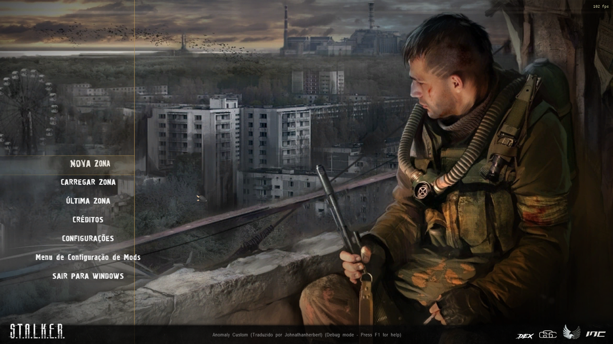
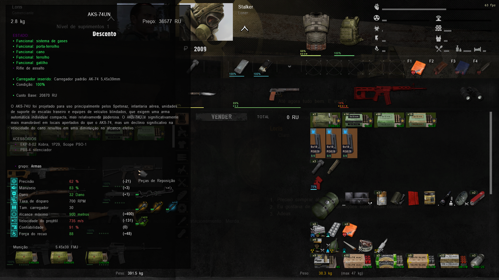
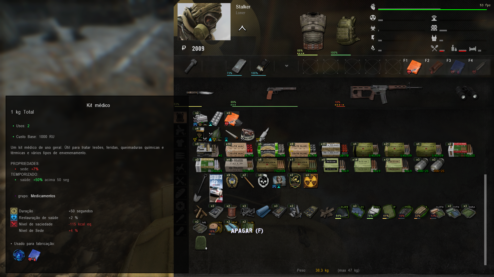

# 🌟 Anomaly Custom EN-PTBR Translation

## 📖 Sobre o Projeto

Uma tradução completa e profissional do mod Anomaly Custom para Português do Brasil (PT-BR). Nossa missão é trazer a melhor experiência possível para jogadores brasileiros, mantendo a atmosfera única de S.T.A.L.K.E.R.

## ✨ Características

- 📚 **99% Traduzido** - Praticamente todo o conteúdo já está em português
- 📝 **80% Revisado** - Processo de revisão em andamento para garantir qualidade
- 🔄 **Consistência** - Termos padronizados em todo o jogo
- 🎮 **Testado em Jogo** - Todas as traduções são verificadas no ambiente do jogo

## 🖼️ Demonstração

  
   
  <em>Tradução completa do menu do jogo</em>

  
   
  <em>Interface do usuário traduzida mantendo nomes originais de itens e armamentos</em>

  
   
  <em>Sistema de inventário com descrições em português</em>

## 📊 Status do Projeto

| Categoria | Progresso |
|-----------|-----------|
| Diálogos |  |
| Interface |  |
| Itens |  |
| Descrições |  |

## 📥 Instalação

1. Baixe a última versão da tradução
2. Abra o ModOrganizer
3. Instale a tradução
4. Pronto! Bom jogo!

## 🤝 Contribuindo

Encontrou um erro ou quer ajudar a melhorar a tradução? 
- Abra uma [Issue](https://github.com/seu-usuario/AnomalyCustomEN-PTBR-translation/issues)

## 📈 Progresso da Revisão

  

## 📝 Notas de Atualização

### Versão 1.0.0
- Tradução inicial com 99% do conteúdo
- Revisão de 80% do conteúdo
- Correções de consistência

## 👥 Equipe

- **Johnathan Herbert** - Tradutor Principal

## 💝 Apoie o Projeto

Se você gostou do projeto e deseja contribuir:

Informações para doação

**Chave Pix:** `016508d2-3500-4f82-9b67-07a9c7710861`

  

   
  <em>Bom jogo, S.T.A.L.K.E.R.!</em>

